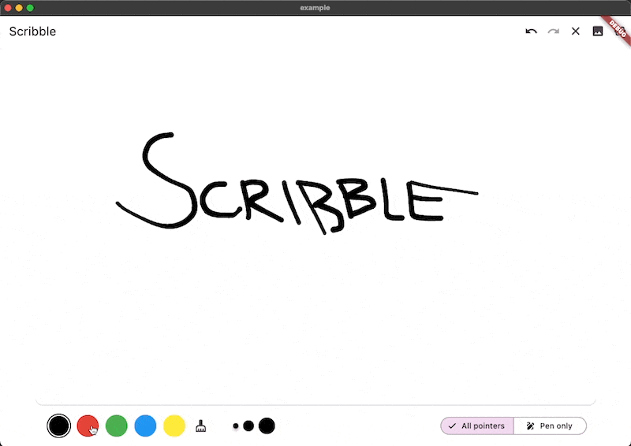

# Scribble
Scribble is a lightweight library for freehand drawing in Flutter supporting pressure, variable line width and more!



> Note: Scribble is still in development and will receive more features down the line!

## Features

* Variable line width
* Image Export
* Pen and touch pressure support
* Choose which pointers can draw (touch, pen, mouse, etc.)
* Lines get slimmer when the pen is moved more quickly
* Line eraser support
* Full undo/redo support using [history_state_notifier](https://pub.dev/packages/history_state_notifier)
* Sketches are fully serializable to JSON

## Pipeline

* [X] Load sketches
* [X] PNG export

## Usage

> You can find a full working example in the [example](./example) directory

You can create a drawing surface by adding the ``Scribble`` widget to your widget tree and passing in
a ``ScribbleNotifier``.

Where you manage this notifier is up to you, but since it is a ``StateNotifier``, it works amazingly
with [riverpod](https://pub.dev/packages/flutter_riverpod) for example.

```dart
import 'package:flutter_riverpod/flutter_riverpod.dart';

final scribbleStateProvider =
StateNotifierProvider.autoDispose<ScribbleNotifier, ScribbleState>(
      (ref) => ScribbleNotifier(),
);
```

You can then pass the notifier to the scribble widget.

```dart
import 'package:flutter/material.dart';
import 'package:flutter_riverpod/flutter_riverpod.dart';

class App extends ConsumerWidget {
  @override
  Widget build(BuildContext context, ScopedReader watch) {
    return Scaffold(
      body: Scribble(
        notifier: watch(scribbleStateProvider.notifier),
      ),
    );
  }
}
```

Use the public methods on ``ScribbleNotifier`` to control the behavior (for example from a button in the UI:

```dart
// Set color
notifier.setColor(Colors.black);

// Clear
notifier.clear();

// Undo
notifier.undo();

// Export to Image
notifier.renderImage(pixelRatio: 2.0);

// And more ... 
```

## Additional information

As mentioned above, the package is still under development, but we already use it in the app we are currently
developing.

Feel free to contribute, or open issues in our [GitHub repo](https://github.com/timcreatedit/scribble).